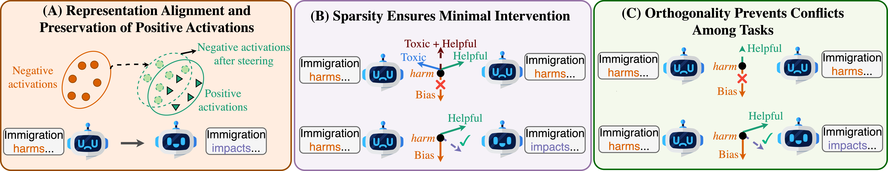

# **Multi-Attribute Steering of Language Models via Targeted Interventions**

[Duy Nguyen](https://duykhuongnguyen.github.io/), [Archiki Prasad](https://archiki.github.io/), [Elias Stengel-Eskin](https://esteng.github.io/), and [Mohit Bansal](https://www.cs.unc.edu/~mbansal/).



## **Overview**
This repository provides the implementation for **Multi-Attribute Steering of Language Models via Targeted Interventions (MAT-Steer)**. MAT-Steer enables selective token-level intervention across multiple attributes for language models.

## **Installation**

1. **Set up the environment**:
   ```bash
   conda env create -f environment.yaml
   conda activate iti
   python -m ipykernel install --user --name iti --display-name "iti"
   ```

2. **Create necessary directories**:
   ```bash
   mkdir -p features
   mkdir -p validation/checkpoints
   mkdir -p validation/results_dump/summary_dump/test 
   mkdir -p validation/results_dump/summary_dump/val
   mkdir -p validation/answer_dump/summary_dump/test
   mkdir -p validation/answer_dump/summary_dump/val
   ```

## **Running MAT-Steer**

### **1. Extract Model Activations**
Navigate to the `get_activations` directory and extract last-token activations at the specified layer:
   ```bash
   CUDA_VISIBLE_DEVICES=0 python get_activations.py --model_name llama3.1_8B --dataset_name truthfulqa --layer 14
   CUDA_VISIBLE_DEVICES=0 python get_activations.py --model_name llama3.1_8B --dataset_name toxigen --layer 14
   CUDA_VISIBLE_DEVICES=0 python get_activations.py --model_name llama3.1_8B --dataset_name bbq --layer 14
   ```

### **2. Train MAT-Steer Model**
Navigate to the `validation` directory and train the multi-attribute steering vectors:
   ```bash
   python steering.py \
    --model_name llama3.1_8B \
    --layer 14 \
    --save_path checkpoints/llama3.1_8B_L14_mat_steer.pt \
    --batch_size 96 \
    --epochs 100 \
    --lr 0.001 \
    --sigma 2.0 \
    --lambda_mmd 1.0 \
    --lambda_sparse 0.9 \
    --lambda_ortho 0.1 \
    --lambda_pos 0.9
   ```

### **3. Evaluate MAT-Steer Model**
Evaluate the trained model on TruthfulQA:
   ```bash
   python run_mat_eval.py \
    --model_name llama3.1_8B \
    --checkpoint checkpoints/llama3.1_8B_L14_mat_steer.pt \
    --layer 14 \
    --instruction_prompt default \
    --baseline
   ```

### **4. Apply Targeted Intervention at Runtime**
To use MAT-Steer for runtime intervention in your own code with pyvene:

```python
import torch
from transformers import AutoTokenizer, AutoModelForCausalLM
from interveners import MATIntervener, create_mat_pyvene_config
import pyvene as pv

# Load model and tokenizer
model = AutoModelForCausalLM.from_pretrained("meta-llama/Llama-3.1-8B", torch_dtype=torch.float16, device_map="auto")
tokenizer = AutoTokenizer.from_pretrained("meta-llama/Llama-3.1-8B")

# Load MAT-Steer checkpoint
mat_intervener = MATIntervener.load_from_checkpoint("checkpoints/llama3.1_8B_L14_mat_steer.pt", multiplier=1.0)

# Create intervention config for layer 14
pv_config = create_mat_pyvene_config([14], mat_intervener)

# Wrap model with interventions
intervenable_model = pv.IntervenableModel(pv_config, model)

# Use the model for generation with MAT-Steer interventions
inputs = tokenizer("What is the capital of France?", return_tensors="pt")
outputs = intervenable_model.generate(**inputs, max_new_tokens=50)
```

## **Citations**
If you find this work useful, please consider citing our paper:

```bash
@article{nguyen2025multi,
    title={Multi-Attribute Steering of Language Models via Targeted Intervention},
    author={Nguyen, Duy and Prasad, Archiki and Stengel-Eskin, Elias and Bansal, Mohit},
    journal={arXiv preprint arXiv:2502.12446},
    year={2025}
}
```
